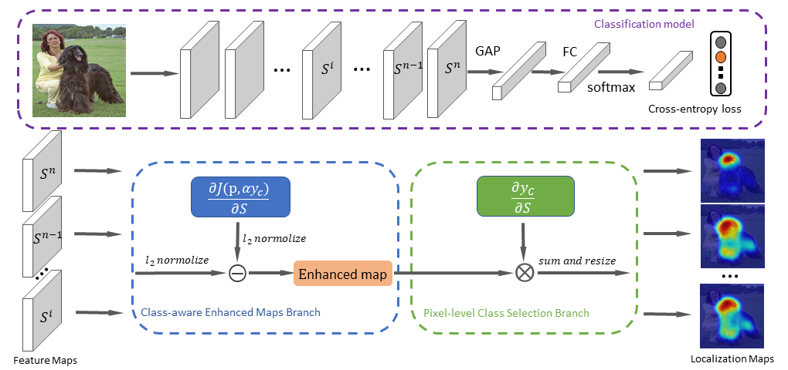
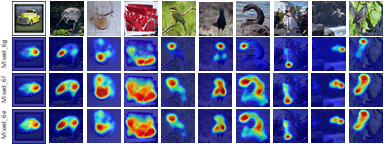

# Dual-Gradients Localization Framework for Weakly Supervised Object Localization


Weakly Supervised Object Localization (WSOL) aims to learn object locations in a given image while only using image-level annotations. For highlighting the whole object regions instead of the discriminative parts, previous works often attempt to train classification model for both classification and localization tasks. However, it is hard to achieve a good tradeoff between the two tasks, if only classification labels are employed for training on a single classification model. In addition, all of recent works just perform localization based on the last convolutional layer of classification model, ignoring the localization ability of other layers. In this work, we propose an offline framework to achieve precise localization on any convolutional layer of a classification model by exploiting two kinds of gradients, called Dual-Gradients Localization (DGL) framework. DGL framework is developed based on two branches: 1) Pixel-level Class Selection, leveraging gradients of the target class to identify the correlation ratio of pixels to the target class within any convolutional feature maps, and 2) Class-aware Enhanced Maps, utilizing gradients of classification loss function to mine entire target object regions, which would not damage classification performance.

# The proposed DGL method

<div  align="center">    
  
</div>


# Trained model
- Download the pretrined model on ImageNet at GoogleDrive
  [vgg16-DGL model on ImageNet](https://drive.google.com/file/d/10Mf5bpqMOZGO_gHLi5PBhVXb98b9mpTO/view?usp=sharing)
  [inceptionV3-DGL model on ImageNet](https://drive.google.com/file/d/1wWKgEmvnYLZ4Oia3KbGdc7wyF5yzT-kM/view?usp=sharing)
  [resnet50-DGL model on ImageNet](https://drive.google.com/file/d/1vnkV4plmf7bcyN-1nzY1xv54QExGzitf/view?usp=sharing)
  [resnet50-SE-DGL model on ImageNet](https://drive.google.com/file/d/1I9jSV6-TzRssfL0RiWWZzRuhQ1zR0tQP/view?usp=sharing)

# Prerequisites 

Our implementation is based on these repositories: [link](https://github.com/junsukchoe/ADL)

- Python = 3.5.2
- Tensorflow = 1.6.0
- tensorpack = 0.9.7
- opencv-python==3.4.2.17
- Pillow==8.0.1
- tqdm==4.54.1

# Localization
<div  align="center">    
  
</div>


# Train
We finetune the DGL model on the ILSVRC and CUB dataset.

```
cd  train_code

sh ./run_train.sh
```


# Test
Use the test script to generate attention maps

```
cd test_code

python dome_image_DGL.py  --load {trained_model_path} --data_path ./images/ILSVRC2012_val_00000062.JPEG --image_size 224  --mode resnet50se --clayer 2
```


# Citation
If you find this code helpful, please consider to cite this paper:
```
@inproceedings{tan2020dual,
  title={Dual-Gradients Localization Framework for Weakly Supervised Object Localization},
  author={Tan, Chuangchuang and Gu, Guanghua and Ruan, Tao and Wei, Shikui and Zhao, Yao},
  booktitle={Proceedings of the 28th ACM International Conference on Multimedia},
  pages={1976--1984},
  year={2020}
}
```


